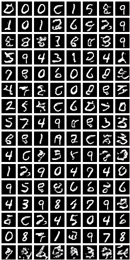

# Image synthesis with energy based models

Simple PyTorch implementation of [Implicit Generation and Generalization in Energy Based Models](https://arxiv.org/pdf/1903.08689.pdf). The images are generated by the descent on the energy function with Langevin stochastic gradient descent.

Samples from the conditional energy model:

